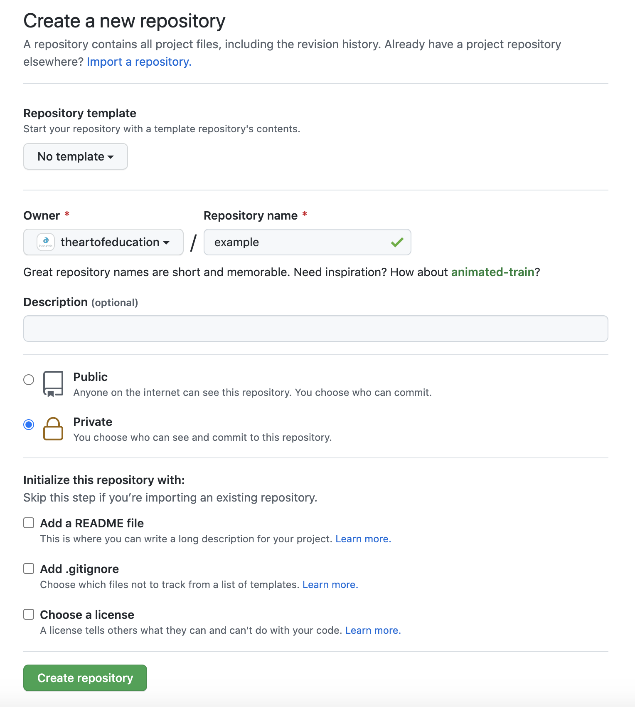

## Basic Setup

* Initialize the repository with `git init` (cli)
* Create a new repository on github (github)
* Select The Art of Education as the owner (github)
* Select the proper repo privacy (github)

* Set the origin with `git remote add origin git@github.com:theartofeducation/your-repo-here.git` (cli)
* create your initial commit and push (cli)

## Common Linting Dependencies

* All projects will require common linting dependencies and these are all written in JavaScript
    1. [commitlint](https://github.com/conventional-changelog/commitlint)
    1. [markdownlint](https://github.com/DavidAnson/markdownlint)
    1. [husky](https://github.com/typicode/husky)
* All projects will have a `package.json` for installing these dependencies and scripts to run these tasks as needed.
* All projects will have a github actions workflow for running these tasks i.e. `.github/workflows/linting.yml`

## Set Default Branch

Some Repo ( such as services and frontends ) the default branch will be `develop` as we need
to have separate deployable units for acceptance and production environments. others ( like libraries
and plugins ) don't need this and the default branch will be `main`.

## Branch Rules & Setup

* For default branch
    * Require a pull request before merging
        * Require at least 3 approvals
        * Dismiss stale pull request approvals when new commits are pushed
        * Require review from Code Owners if the repo has / needs a code owner
    * Require status checks to pass before merging
        * Ensure linting and unit tests are required (if applicable)
        * Require branches to be up to date before merging
    * Require signed commits
    * Require linear history
    * Include administrators
