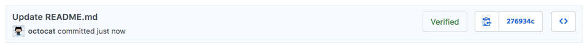
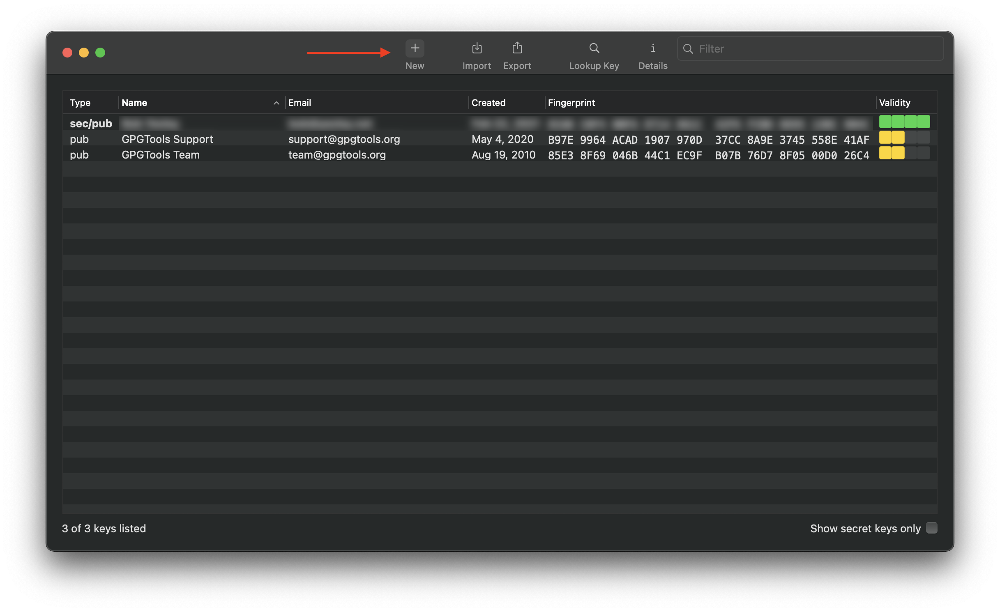
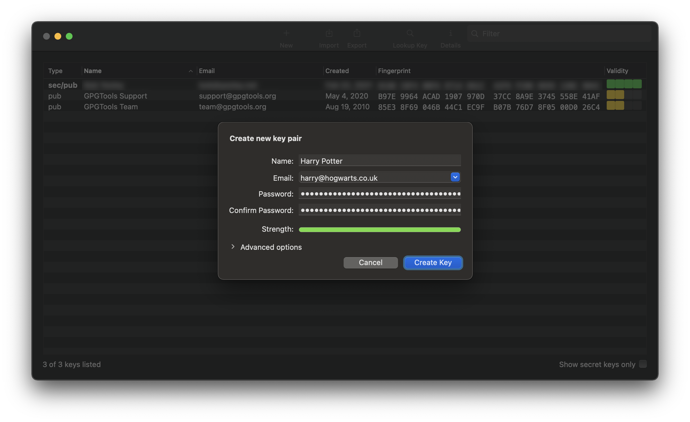
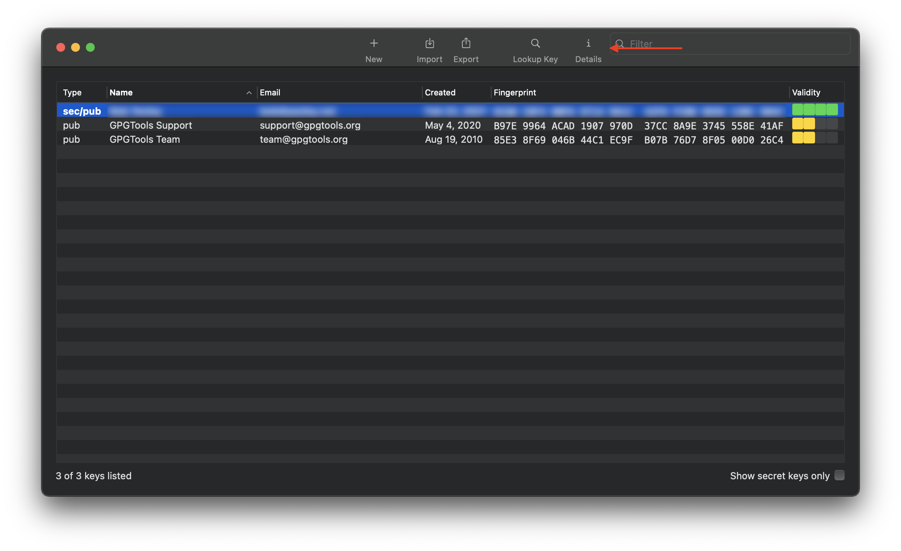
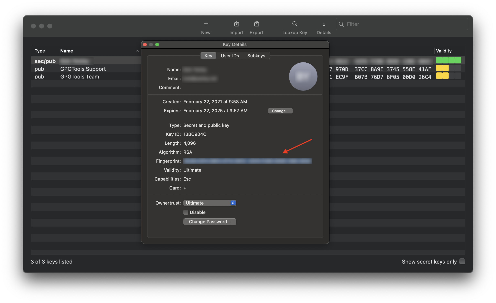

By default, the identity of the author of a commit in a GitHub repository is provided by nothing more the local git configuration. This reality makes it very easy to change your local git configuration to use and apply the identity information of another individual (whatever name and email address you wish to configure locally) to change the information associated with a commit(s) in a git repository.

It is for this reason that **we require the configuration and use of signed/verified commits in all of our git repositories**. This means that, if a repository on GitHub is configured correctly, when you attempt to push commits to it that _are not signed_, GitHub will reject your commits, and the push attempt will fail. This document will cover how to setup your local git configuration to support verified commits.

GitHub describes commit signature verification in this way:

> Using GPG or S/MIME, you can sign tags and commits locally. These tags or commits are marked as verified on GitHub so other people can be confident that the changes come from a trusted source.



[You can find more information about how git and GitHub can use verified commit signatures to help ensure the integrity of commits to code repositories in the GitHub documentation](https://docs.github.com/en/github/authenticating-to-github/managing-commit-signature-verification/about-commit-signature-verification).

## Configuring Verified Commits

### Generate a new GPG key

The first step is to download and install [GPG Suite](https://gpgtools.org/) (this can also be done via Homebrew with `brew cask install gpg-suite`). Once you've installed it, run it, and in the toolbar at the top, click "New" to create a new key pair:



In the resulting dialog, enter your full name, your email address, and a strong password.

:::important
It is strongly recommended that you use a password manager to generate and store a strong password for your key pair. You will need it later, and a password manager is the best way to generate a strong password, and be able to use it at a later time.
:::



Once you have created your new key pair, you will need to copy it, and update your local git configuration with it. In GPG Suite, click to select the new key pair that you created, and on the toolbar at the top, click the "Details".



In the resulting dialog, hover over and user your mouse to highlight/select the value for "Fingerprint", and press `Ctrl/Cmd+C` to copy the value to your clipboard.



Additional detailed instructions for how to do this with an alternative command line utility can be found on [the GitHub documentation](https://docs.github.com/en/github/authenticating-to-github/managing-commit-signature-verification/generating-a-new-gpg-key).

### Configure git to use GPG to sign your commits

Add this value to your local git config with the following command from a terminal prompt:

```sh
$ git config --global user.signingkey <PASTE YOUR KEY FINGERPRINT VALUE HERE>
```

Then, tell git to sign all commits with the following global configuration:

```sh
$ git config --global commit.gpgsign true
```

You will need to set your global git configuration to use the email address that you associated with the key pair that you created above.

```sh
$ git config --global user.email <YOUR EMAIL ADDRESS HERE>
```

:::important
Remember, when executing the command above, enter the email address that you used/entered in GPG Suite when you created your key pair above.
:::

### Add your public key to GitHub

1. Login to [GitHub](https://github.com) and browse to [your user profile settings page](https://github.com/settings/profile).
1. From the menu on the left, click the [SSH and GPG keys menu item](https://github.com/settings/keys).
1. In the "GPG Keys" section, click the "New GPG Key" button to add your new GPG key to your user profile.
1. Open GPG Suite again, and find the key pair that you created in the steps above. **Right-click** on it, and from the resulting context menu, click the "**Copy**" menu item. This will copy the public key to your clipboard.
1. Switch back over to GitHub in your web browser, and on the New GPG Key page, in the text box, paste the public key you copied from GPG Suite, and click the "Add GPG Key" button to save it. When you are returned to the keys page, under the GPG Keys section, you should see the new key that you just added. Check the details of that key, and ensure that the email address associated with the key matches the email address that you used to create the key (just to ensure that you copy/pasted the right one from GPG Suite).

Additional details, including screenshots, for how to do this, can be found on [the GitHub documentation](https://docs.github.com/en/github/authenticating-to-github/managing-commit-signature-verification/adding-a-new-gpg-key-to-your-github-account).

### Updating your MacOS keychain and testing

Once you've configured verified commits locally, you will want to test your configuration by making a commit and pushing it to one of our GitHub repositories that is setup to require verified commits (which should be all of them). The following steps will guide you through this process.

:::note
Prerequisite - these steps assume that you have cloned one of our repositories to your local machine, and are comfortable working with git from the CLI.
:::

```sh
$ cd your/local/project/working/directory ⏎
$ git checkout -b chore/test-verified-commits ⏎
$ git commit --allow-empty --no-verify -m "chore($(git config --get user.name)): verifying signed commits on $(date "+%Y-%m-%d")" ⏎
$ git push origin chore/test-verified-commits ⏎
```

The first time that you attempt to create a commit after the above configuration, you should be prompted to enter your signing key password that you used to create your GPG key pair above. When you enter the password, there should be an option on the prompt dialog to allow you to save the password in your MacOS keychain. If everything on your local machine is setup correctly, and you are prompted as expected and check this option, you should not be prompted again after entering it this initial time.

After you've done this, open the repository on GitHub, and browse to `/commits/chore/test-verified-commits` path in the repository to view the commits. The commit that you just added should be displayed at the top of the list of commits in the repository, and you should see the "Verified" tag on the commit, as in the screen capture below:


Once you've verified that your verified commit configuration is setup and working correctly, you can delete the branch you created for testing with the following commands.

```sh
$ git checkout develop ⏎
$ git branch -D chore/test-verified-commits ⏎
$ git push origin --delete chore/test-verified-commits ⏎
```

_Aaannnnd ... you're done._

## Additional Info

Some useful information can be found [here on keeping your GPG key safe](https://github.com/sparkbox/standard/blob/1ca790bf2e5d553264b5d746ab3a9c91a6ffb766/security/security_policy_compliance/verified-commits.md#keeping-your-key-safe), and [GPG key expiration](https://github.com/sparkbox/standard/blob/1ca790bf2e5d553264b5d746ab3a9c91a6ffb766/security/security_policy_compliance/verified-commits.md#expired-keys).
